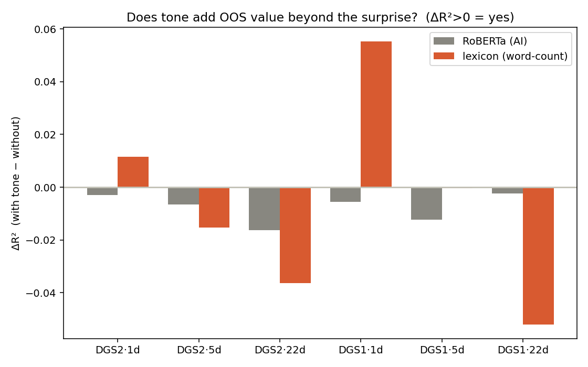
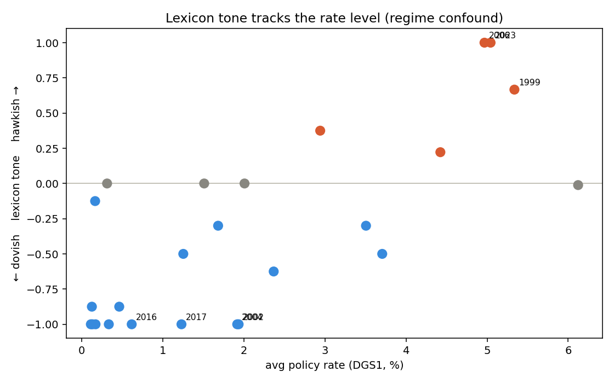

# CB_Policy_Analysis

Research-grade pipeline for **Federal Reserve / FOMC policy-text analysis**: fetch FOMC
statements, score monetary-policy stance (hawkish/dovish), and test — **out-of-sample and
look-ahead-safe** — whether that text carries predictive information for market rates
**beyond the policy surprise already priced in**.

The honest question this repo answers: *does the Fed's wording tell you anything about
rates that the rate decision itself doesn't?* So far, rigorously, the answer is **no** —
and the value is a trustworthy apparatus that can prove it (and catch the confounds that
make weaker analyses say "yes").

**Stack:** Python ≥3.11 · pandas/statsmodels · pytest (128 tests). Research-grade, not a trading signal.

## Findings so far

| Phase | Signal tested | Verdict | Why |
|------|----------------|---------|-----|
| 0 | Doc-mixed TDW stance → DGS2/EFFR | **NO-GO** | Harness validated; mixed-doc stance has no OOS forward power (confounded by doc timing/role). |
| 1 | FOMC-RoBERTa statement stance, marginal over Bauer-Swanson surprise | **NO-GO** | ΔR²<0 at all 6 (DGS2/DGS1 × h1/5/22), n=177. Canonical-confirmed on the gated `gtfintechlab/FOMC-RoBERTa`. |
| 2a | Transparent hawk/dove **word-count** lexicon, same test | **NO-GO** | Apparent ΔR²>0 at h=1 (DGS1 +0.055) — but hardening shows a **policy-regime confound**, not text information. |

The Phase 2a result is the interesting one. A simple word-counter *looked* like it beat the
transformer at the 1-day horizon — then adversarial checks (`scripts/lexicon_confound_check.py`)
showed the "signal" is just easing-era vs hiking-era vocabulary: the tone score correlates +0.65
with the rate level, a regime control absorbs it, and the effect sign-flips when the pre-2008
sub-sample is dropped. Because the lexicon is **transparent**, we could diagnose the confound a
black box would have hidden. Full write-up: [docs/results/2026-06-29-lexicon-baseline-verdict.md](docs/results/2026-06-29-lexicon-baseline-verdict.md).





## Repository layout

```
src/cbp/
  data/      FRED client, FOMC statement fetch/parse, Bauer-Swanson surprise loader, calendars
  models/    stance scorers — FOMC-RoBERTa (stance_scorer) and the lexicon (lexicon_scorer); baselines
  align/     build_aligned_panel — leak-safe release→forward-window alignment
  eval/      walk-forward OOS, nested ΔR², event study, metrics
  viz/       pure tone-comparison logic (matplotlib stays in scripts/)
  config.py  targets, horizons, model id, lexicon path
  cli.py     `--mode {phase0,phase1}` · `--tone-method {roberta,lexicon}`
data/lexicons/hawk_dove.json   versioned, corpus-validated policy-stance lexicon
scripts/     diagnostic + figure/verdict reproduction scripts
docs/        prd/ (specs) · plans/ · results/ (verdicts + figures) · context/ (working memory)
tests/       pytest suite (TDD; offline — never imports torch/transformers)
```

## Install

```bash
pip install -e ".[dev]"            # core + tests
pip install -e ".[dev,infer,viz]"  # + RoBERTa inference (torch/transformers) + matplotlib figures
```

## Usage

Live runs need `FRED_API_KEY`; the gated RoBERTa run needs a Hugging Face token with gated-repo
read access. Cached statements + the Bauer-Swanson surprise file live under `data/raw/`.

```bash
# Phase 1 — RoBERTa stance, marginal OOS vs the BS surprise (the canonical run)
FRED_API_KEY=... python -m cbp.cli --mode phase1

# Phase 2a — transparent lexicon stance, same harness
FRED_API_KEY=... python -m cbp.cli --mode phase1 --tone-method lexicon

# Reproduce the analysis + figures
python scripts/lexicon_confound_check.py     # regime/era hardening of the h=1 result
python scripts/plot_tone_timeseries.py       # lexicon vs RoBERTa tone over time
python scripts/plot_verdict_figures.py       # the 5-figure verdict pack -> docs/results/figures/
python -m cbp.monitor --rebuild-only         # rebuild the descriptive dashboard (see "Statement monitor" below)

pytest                                        # 128 tests
```

### FOMC Statement Tracker (live dashboard)

**Live:** https://alanvaa06.github.io/CB_Policy_Analysis/

A transparent, reproducible reader for every FOMC statement. Each meeting it shows:

- **What changed** — a word-level redline of the latest statement vs the prior one (boilerplate stripped).
- **What the Fed is focused on** — theme intensity over time (inflation, employment, growth, balance sheet, financial conditions).
- **How much it changed** — the edit-distance of each statement vs the one before, so pivotal meetings stand out.
- **Communication style** — statement length, readability, and uncertainty-word density across 1999→today.
- **Stance, in context** — the transparent action/lexicon measures (RoBERTa optional), with an on-page glossary.

```bash
python -m cbp.monitor                 # score new statements + rebuild dashboard (.[site]; add .[infer] for RoBERTa)
python -m cbp.monitor --no-roberta    # torch-free run
python -m cbp.monitor --rebuild-only  # re-render from committed data (the CI path; .[site] only)
```

Each run upserts `data/monitor/tone_history.csv` + `latest_redline.json` (commit both); CI (`.github/workflows/pages.yml`) re-renders torch-free and publishes to `gh-pages`. Extend the meeting list yearly in `data/monitor/fomc_calendar.csv`.

## Method notes

- **Leak-safety:** targets are strictly forward of each release timestamp; the walk-forward trains
  only on releases `[0, i)` before predicting `i`. Enforced by tests.
- **Marginal test:** the question is never "does tone correlate with rates" (it does, mechanically —
  text co-moves with the same-day decision) but "does tone add **out-of-sample** R² **beyond** the
  Bauer-Swanson orthogonalized surprise." A null here is a real, publishable result.
- **Lexicon transparency:** the hawk/dove list is small, corpus-validated, and excludes boilerplate
  (`inflation`), economic-condition valence (`weak`/`downside`), and dead seeds — by design and by test.
- **Two lexicons, two jobs:** `hawk_dove.json` is the *predictive* stance measure (tested above); it goes
  silent on 2024+ statements, which use action verbs not stance adjectives. `action_tone.json` is a
  separate *descriptive* hike/cut/hold tracker (`raise`/`lower`) — it mirrors the decision, so it is
  monitoring-only and carries no marginal predictive value by construction.

## Working memory & conventions

Durable project context lives in `docs/context/` (`memory.md`, `lessons.md`, `todo.md`,
`results.md`, `sesion-log.md`) — read on demand, not bulk-loaded. Product specs in `docs/prd/`,
implementation plans in `docs/plans/`, verdicts in `docs/results/`. See `CLAUDE.md` for conventions.
