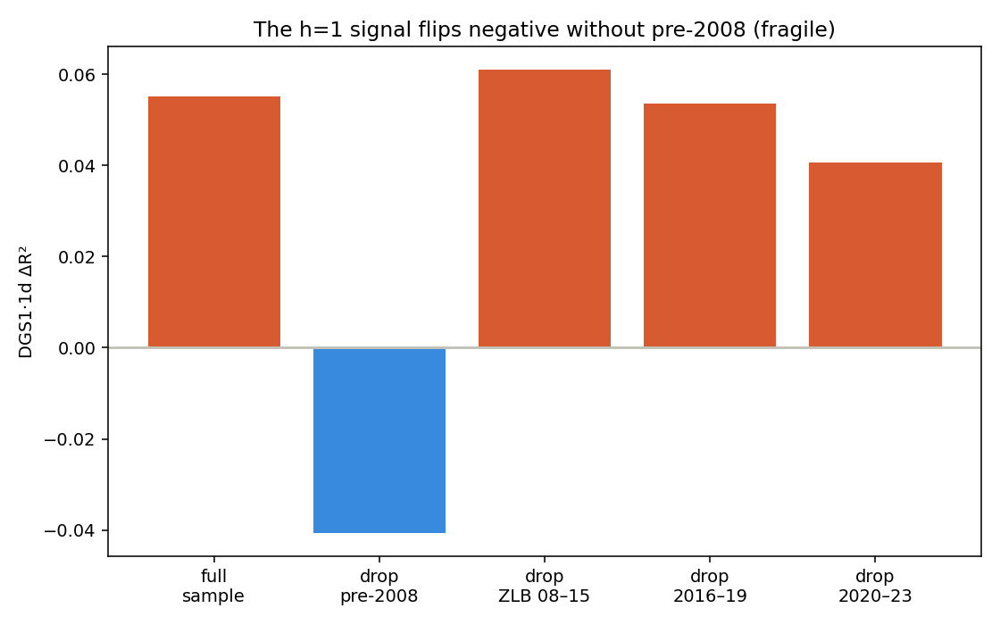
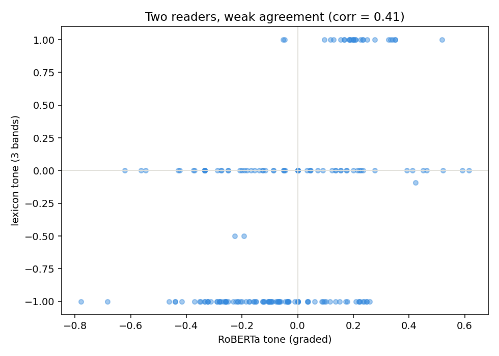
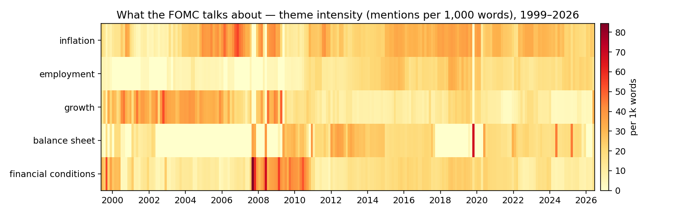
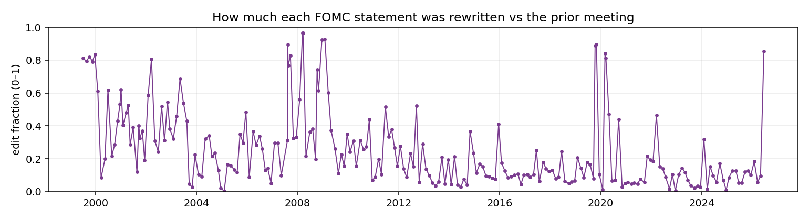
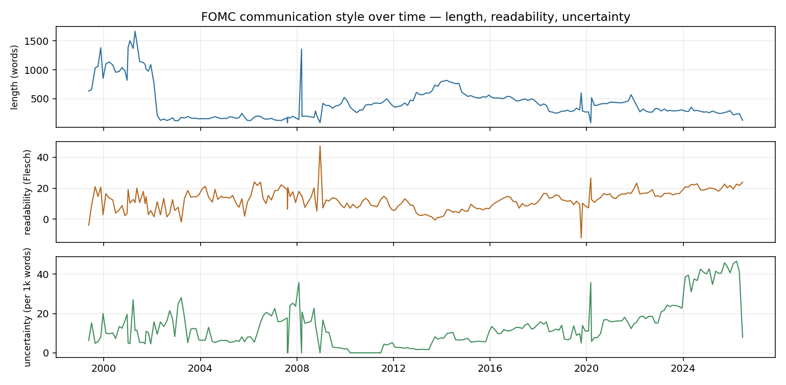
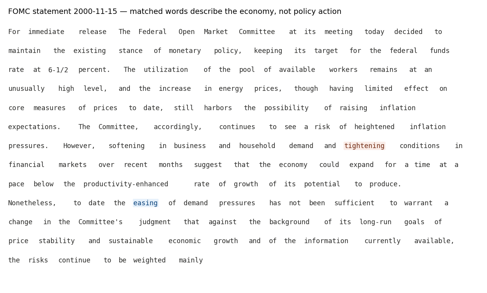
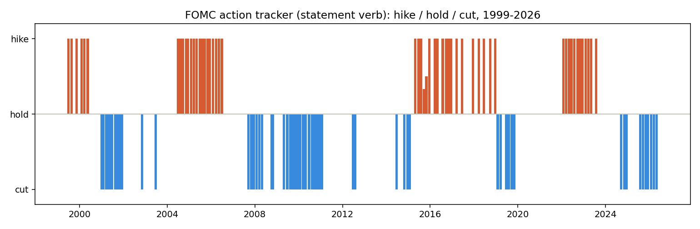

# CB_Policy_Analysis

### Does the Fed's *wording* tell you anything about interest rates that its *decision* doesn't?

A research-grade, look-ahead-safe pipeline for **Federal Reserve / FOMC policy-text analysis**. It scores the monetary-policy stance of every FOMC statement (1999–present) and tests, out-of-sample, whether that text carries information for market interest rates **beyond the policy surprise already priced in**. It then repackages the machinery that answers that question as a live, transparent **FOMC Statement Tracker**.

**Live dashboard:** https://alanvaa06.github.io/CB_Policy_Analysis/
**Stack:** Python ≥3.11 · pandas / statsmodels · pytest (131 tests, offline) · Plotly. Research-grade — *not* a trading signal.

---

## Abstract

A large literature reports that the *tone* of central-bank communication predicts interest rates. Almost all of it is in-sample and correlational. We ask the sharper, harder question: does statement tone add **out-of-sample** explanatory power for market rates **after controlling for the monetary-policy surprise** — the part of the decision markets did not expect? Across three measurement approaches — a document-mixed stance index, a transformer (FOMC-RoBERTa), and a transparent hawkish/dovish word-count lexicon — the answer is a rigorously established **null**: statement tone adds no robust marginal out-of-sample information beyond the rate surprise. The one apparent exception is diagnosed as a **policy-regime confound**, not text information — a diagnosis that was only possible *because* the lexicon is transparent. The negative result is the contribution: a trustworthy apparatus that resists the confounds which make weaker analyses report false positives. The same corpus and scorers are then turned into a **descriptive tracker** — what each statement says, how it changed, what the Fed is focused on — which is where the durable, honest value lies.

---

## 1. Research question and motivation

The FOMC's post-meeting statement is the most watched sentence-for-sentence document in macro. The market reaction to a meeting has two parts: the **rate surprise** (the decision and guidance relative to expectations) and, potentially, the **residual information in the wording** (nuance not captured by the headline surprise). The interesting, testable claim is about the second part:

> Conditional on the policy surprise, does the statement's *language* move rates?

This is a marginal, out-of-sample question. It is deliberately *not* "does tone correlate with rates" — it does, mechanically, because the text co-moves with the same-day decision. A publishable, decision-relevant result requires isolating the text's contribution **beyond** the surprise, and validating it **out-of-sample**.

## 2. Data

| Series | Source | Coverage |
|---|---|---|
| FOMC statements (post-meeting) | federalreserve.gov (two page eras, scraped + cached) | 1999-05 → present (226 scored) |
| Policy surprise (orthogonalized) | Bauer–Swanson `MPS_ORTH` | 1999 → 2023 |
| Market rates | FRED (`DGS1`, `DGS2`) | daily |
| Stance model | `gtfintechlab/FOMC-RoBERTa` (Trillion Dollar Words, ACL 2023; CC BY-NC) | — |

Announcement dates and the surprise control are drawn from a **single source** so statement fetching, the release calendar, and the control align one-to-one; using a multi-doc-type calendar contaminates the sample and was an early, documented error.

## 3. Methodology

- **Leak-safety.** For each release, prediction targets are strictly forward of the release timestamp; a walk-forward trains only on releases `[0, i)` before predicting release `i`. Enforced by tests (a deliberate look-ahead injection must fail).
- **The marginal test.** For each target × horizon, we compare the out-of-sample R² of a surprise-only model against surprise + tone (nested OOS ΔR²), plus an in-sample partial-t on tone and a residual event-study cross-check. A tone measure "wins" only if it adds OOS R² *beyond* the Bauer–Swanson orthogonalized surprise.
- **Three tone measures, same harness.** (i) a document-mixed stance index; (ii) FOMC-RoBERTa per-sentence-mean stance; (iii) a small, corpus-validated hawkish/dovish **word-count lexicon** that excludes boilerplate (`inflation`), economic-condition valence (`weak`/`downside`), and dead seeds — by design and by test.
- **Adversarial hardening.** Any positive OOS ΔR² on a slow-moving text feature is stress-tested against a regime confound: control for the rate level / cycle, and jackknife by era.

## 4. Findings

| Phase | Signal tested | Verdict | Why |
|------|----------------|---------|-----|
| 0 | Doc-mixed stance → DGS2 / EFFR | **NO-GO** | Harness validated; mixed-doc stance has no OOS forward power (confounded by doc timing/role). |
| 1 | FOMC-RoBERTa stance, marginal over the BS surprise | **NO-GO** | ΔR² < 0 at all 6 cells (DGS2/DGS1 × h = 1/5/22), n = 177. Canonical-confirmed on the gated `gtfintechlab/FOMC-RoBERTa`. |
| 2a | Transparent hawk/dove **word-count** lexicon, same test | **NO-GO** | Apparent ΔR² > 0 at h = 1 (DGS1 +0.055) — but hardening shows a **policy-regime confound**, not text information. |


**The Phase 2a result is the instructive one.** A simple word-counter *looked* like it beat the transformer at the one-day horizon. Adversarial checks (`scripts/lexicon_confound_check.py`) show the "signal" is easing-era vs hiking-era vocabulary: the tone score correlates **+0.65 with the rate level**, a regime control absorbs the gain (DGS1 h=1 ΔR² +0.055 → +0.016), and the effect **sign-flips** when the pre-2008 sub-sample is dropped, with a backwards coefficient. Because the lexicon is transparent, we could *diagnose* a confound a black box would have hidden.




The transformer and the transparent lexicon track the same hawk–dove axis but aggregate differently; neither survives the marginal test. Full write-up: [docs/results/2026-06-29-lexicon-baseline-verdict.md](docs/results/2026-06-29-lexicon-baseline-verdict.md).



## 5. From a null result to a descriptive tool — the FOMC Statement Tracker

The predictive question is settled (a null). But the same fetch-and-score machinery answers a different, genuinely useful question with no marginal-value claim required: **what does each statement say, how did it change, and what is the Fed focused on?** That is the [live tracker](https://alanvaa06.github.io/CB_Policy_Analysis/), rebuilt after every meeting from a committed, torch-free data file.

**What the Fed talks about (themes over time).** Term-intensity (mentions per 1,000 words) for five policy themes. The descriptive record is legible: financial-conditions language spikes in 2008, balance-sheet language lights up through the QE era (2009–14) and again in 2019–20, and employment emphasis grows through the forward-guidance decade.



**How much each statement changed.** The word-level edit distance of each statement vs the prior one — pivotal meetings (regime shifts, crises) stand out as spikes.



**Communication style.** Statement length, Flesch readability, and hedging/uncertainty density — how the Committee *communicates*, independent of what it decides.



**What changed, word-for-word.** The tracker's headline panel is a word-level "track-changes" redline of the latest statement vs the prior (boilerplate stripped, mojibake repaired) — the view FOMC-watchers actually read.



The transparent stance measures are retained for continuity, in context and with an on-page glossary; the descriptive action tracker (hike/hold/cut, from the decision verb) mirrors the decision by construction and is monitoring-only.



## 6. Caveats and limitations

- **Descriptive, not predictive.** No tracker metric is a rate forecast. The predictive verdict is a null; the tracker's value is transparency and legibility.
- **Themes are presence, not sentiment.** A theme fires whether the Fed is worried or reassured about it — the claim is intensity, not stance.
- **The stance lexicon is era-bound.** It goes silent on 2024+ statements, which express stance through the rate-action verb rather than stance adjectives; adding those verbs would make the measure redundant with the decision by construction. RoBERTa carries continuous stance on modern statements (populated on a separate inference run).
- **Change-magnitude conflates restructuring with substance** — a reordered-but-same statement scores high; it is paired with the redline (which shows *what*) for this reason.
- **`clean_statement` and Flesch are heuristics** across two page eras — conservative markers, an empty-guard fallback, and vowel-group syllables; read trends, not absolutes.
- **Control granularity.** The Bauer–Swanson surprise is intraday-calibrated while the targets are daily FRED closes — a known limitation of the marginal test that does not overturn a null.
- **Licensing.** FOMC-RoBERTa is CC BY-NC 4.0 (research use). The tracker publishes derived *scores*, not weights.

## 7. Reproducibility

```bash
pip install -e ".[dev]"              # core + tests
pip install -e ".[dev,site]"         # + Plotly dashboard render (torch-free)
pip install -e ".[dev,infer,viz]"    # + RoBERTa inference (torch) + matplotlib figures
pytest                               # 131 tests, offline (never imports torch or hits the network)
```

**Reproduce the research (needs `FRED_API_KEY`; the gated RoBERTa run needs a Hugging Face gated-repo token):**

```bash
FRED_API_KEY=... python -m cbp.cli --mode phase1                      # RoBERTa stance, marginal OOS vs the surprise
FRED_API_KEY=... python -m cbp.cli --mode phase1 --tone-method lexicon # transparent lexicon, same harness
python scripts/lexicon_confound_check.py                              # regime / era hardening of the h=1 result
python scripts/plot_verdict_figures.py                               # the verdict figure pack
python scripts/plot_tracker_figures.py                               # the tracker figures in this README
```

**Run / update the live tracker:**

```bash
python -m cbp.monitor                 # score new statements → update data → rebuild dashboard (.[site]; add .[infer] for RoBERTa)
python -m cbp.monitor --no-roberta    # torch-free run (RoBERTa column gapped)
python -m cbp.monitor --rebuild-only  # re-render from committed data only (the CI path)
```

**When a new FOMC statement is released** (the routine step):

```bash
python -m cbp.monitor --no-roberta                                    # fetch + score the new statement, rebuild
git add data/monitor/tone_history.csv data/monitor/latest_redline.json
git commit -m "data: <YYYY-MM-DD> FOMC statement"
git push                                                              # CI re-renders and republishes to GitHub Pages
```

- The new meeting date must exist in `data/monitor/fomc_calendar.csv` (extend it yearly from the Fed calendar); or force a single date with `python -m cbp.monitor --date YYYY-MM-DD`.
- `data/monitor/tone_history.csv` (charts) and `latest_redline.json` (redline) are the **committed contract** between a local scoring run and the torch-free CI render; the built `site/index.html` is a derived artifact published to the `gh-pages` branch by `.github/workflows/pages.yml`.

## 8. Repository layout

```
src/cbp/
  data/      FRED client, FOMC statement fetch/parse, Bauer–Swanson surprise loader, calendars
  models/    stance scorers — FOMC-RoBERTa (stance_scorer) and the transparent lexicon; baselines
  align/     build_aligned_panel — leak-safe release → forward-window alignment
  eval/      walk-forward OOS, nested ΔR², event study, metrics
  monitor/   the Statement Tracker — history, calendar, score, metrics, contrast (redline), site, CLI
  viz/       pure tone-comparison logic (matplotlib stays in scripts/)
data/lexicons/   hawk_dove.json (stance) · action_tone.json (decision) · themes.json (topics)
data/monitor/    tone_history.csv · latest_redline.json · fomc_calendar.csv (committed)
scripts/         diagnostic + figure-reproduction scripts
docs/            prd/ (specs) · plans/ · results/ (verdicts + figures) · context/ (working memory)
tests/           pytest suite (TDD; offline — never imports torch/transformers)
```

Durable project context lives in `docs/context/` (`memory.md`, `lessons.md`, `todo.md`, `results.md`, `sesion-log.md`) — read on demand. Product specs in `docs/prd/`, implementation plans in `docs/plans/`, verdicts in `docs/results/`. See `CLAUDE.md` for conventions.
